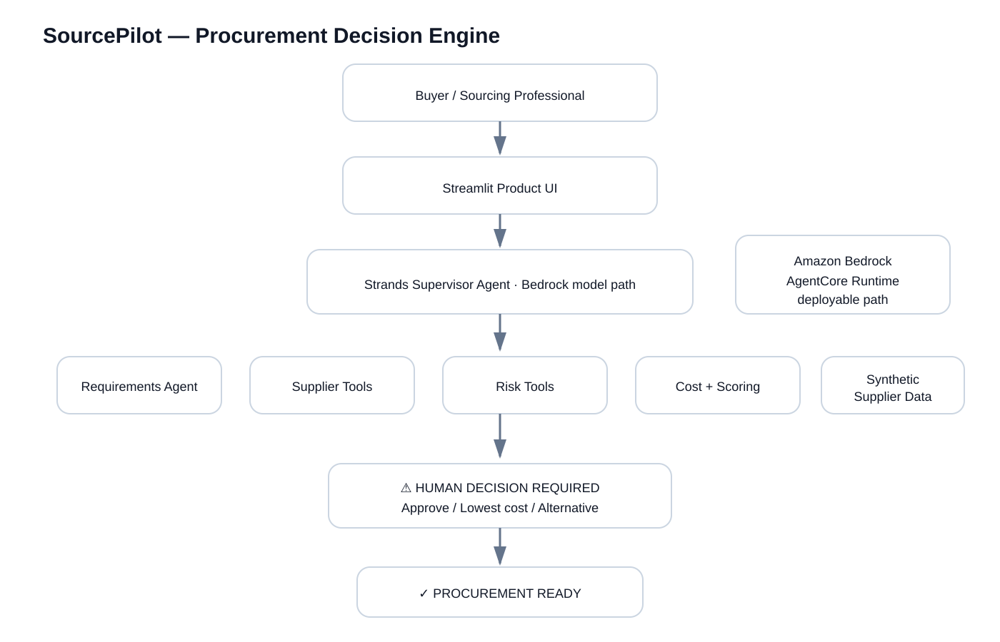

# SourcePilot

**From Buyer Message to Procurement Decision.**

SourcePilot is an autonomous AI sourcing agent that turns an overseas buyer's messy product request into a decision-ready China procurement plan and only asks the human when a real business decision is required.

> Hackathon: AWS / Devpost **Agents for Humans** · Track: **Professional Agents**
>
> Data: **Synthetic demonstration data**. No real factory is represented or claimed verified.

## Why this problem
International sourcing is not just “find me a factory.” A buyer may send a photo, approximate quantity, budget and destination. A sourcing professional then has to structure requirements, compare inconsistent quotes, analyze MOQ, calculate cost, identify specification risk and explain trade-offs. SourcePilot turns that workflow into an agentic process.

## Why an agent, not a chatbot
A chatbot waits for prompts. SourcePilot executes a workflow: requirements → RFQ → supplier discovery → risk checks → deterministic cost analysis → transparent ranking → human approval gate → procurement plan. It surfaces itself when judgment matters.

## Hero demo
A Ghana buyer wants 8–12 women’s shoe designs, a small test order, limited budget and a reliable supplier. SourcePilot analyzes 16 synthetic suppliers, exposes risks and identifies a cost-vs-MOQ decision before producing a procurement-ready recommendation.

## Architecture


See `docs/architecture.md` for the Mermaid version and design rationale.

## Stack
- Python
- **Strands Agents SDK**
- Amazon Bedrock-compatible Strands model path
- Amazon Bedrock AgentCore Runtime entrypoint (deployment requires AWS credentials)
- Streamlit
- Deterministic Python cost/risk/scoring tools
- JSON synthetic supplier dataset
- Pytest + GitHub Actions

## Strands implementation
`app/agents/strands_system.py` creates a supervisor with specialized agents for requirements, supplier discovery, quote normalization, risk, commercial analysis and recommendation. The supervisor also has explicit tools:
- `search_suppliers`
- `get_supplier_details`
- `calculate_order_cost`
- `calculate_landed_cost`
- `identify_risks`
- `score_supplier`

`app/agents/agentic_workflow.py` bridges the stable procurement engine and the real Strands supervisor. The language model is not trusted with arithmetic: cost, risk thresholds and supplier scoring remain deterministic and auditable.

## Human in the loop
SourcePilot does not make irreversible commercial commitments. When the cheapest quote creates materially higher MOQ exposure, material mismatch, or another meaningful trade-off, the UI enters **HUMAN DECISION REQUIRED** and waits for approval.

The decision card explicitly shows *why* the human is being interrupted, including unit-price savings, extra units forced by MOQ and additional EXW inventory exposure.

## Run locally
```bash
python -m venv .venv
source .venv/bin/activate  # Windows: .venv\Scripts\activate
pip install -r requirements.txt
python run.py
```

### Stable demo mode
```bash
export SOURCEPILOT_AGENT_MODE=demo
python run.py
```

### Real Strands + Bedrock mode
Configure AWS credentials, then:
```bash
export SOURCEPILOT_AGENT_MODE=strands
export BEDROCK_MODEL_ID=<your-bedrock-model-id>
python run.py
```

If Strands/Bedrock invocation is unavailable, SourcePilot preserves the deterministic workflow rather than breaking the demo.

## Tests
```bash
pytest -q
```

Current local result: **10 passed**. GitHub Actions runs the same deterministic workflow tests on every push.

## AgentCore
This repository includes `app/agentcore_entry.py` using `BedrockAgentCoreApp`. Deployment is deliberately not claimed until it succeeds in the entrant's AWS account. See `docs/agentcore-deploy.md`.

## Demo-mode integrity
`SOURCEPILOT_AGENT_MODE=demo` uses the same supplier data, cost tools, risk rules, ranking logic and human-approval state as the live path while avoiding external model latency. It is a stability mode, not a fake result renderer.

## Privacy and limitations
- No real customer identities or confidential quotations.
- No claim of factory verification or supplier legitimacy.
- Freight is a modeled estimate in synthetic data.
- Customs duty/tax, certification and legal compliance are not calculated.
- A human must verify critical commercial facts before purchase.

## Repository layout
```text
app/       UI, agents, tools, models
data/      synthetic suppliers
tests/     deterministic workflow tests
docs/      rules, architecture, Devpost copy, video plan, audit
assets/    architecture + static demo preview
```

## Roadmap
Authorized supplier APIs, quotation-PDF parsing, email/RFQ integration, freight APIs, collaborative procurement, supplier performance history, and purchase-order workflows.

## AI assistance disclosure
AI coding assistance was used to accelerate implementation, documentation and testing. Product concept, sourcing workflow, trade-off design and submission decisions remain the entrant's work.

## License
MIT.
