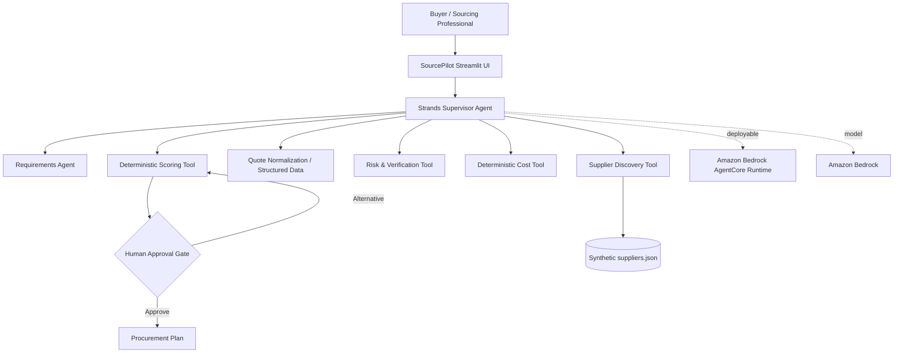

# Architecture

## Design choices
Strands is the agent interface and tool-orchestration layer. Procurement arithmetic, risk thresholds and ranking are deterministic Python so numerical claims are auditable. The UI surfaces autonomy as a workflow rather than a chat transcript, then interrupts the human only for a material cost/risk trade-off.

AgentCore Runtime is implemented as a deployable entrypoint but is not claimed as deployed until an AWS account is actually configured and deployment succeeds.
